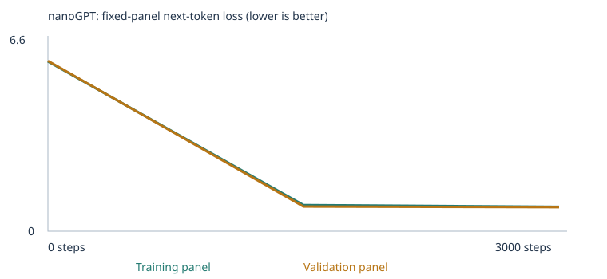
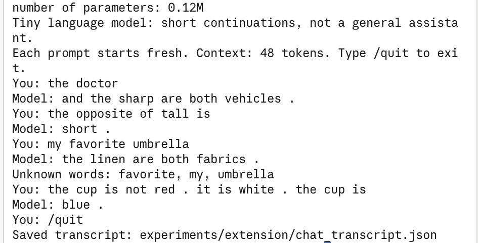

# Class 4 — Building a Custom LLM (nanoGPT, word tokens)

Anthony Brites · From Zero to AI Agents, Fall 26

I trained Karpathy's nanoGPT (2 blocks, 4 heads, 64-dim embeddings, 48-token context,
~112k–128k parameters) from scratch on CPU, twice:

1. **Starter experiment** — the supplied classroom corpus only.
2. **Corpus-extension experiment** — the classroom corpus plus 3,297 teaching passages I
   generated for three of the eval categories: **opposites**, **categories_and_analogies**,
   and **negation**.

Both runs use the same 48 fixed language evals (unchanged), run before and after training.
This is a tiny model that continues sentences from a narrow corpus. It is not a chat
assistant and the numbers below are a development benchmark, not a claim of general ability.

The starter notebook, nanoGPT source, eval runner and chat script come from the
[course sample project](https://github.com/pepealonso95/custom-llm); its original README is
kept as [SAMPLE_PROJECT_README.md](SAMPLE_PROJECT_README.md).

## Repository map

| What | Where |
|---|---|
| Executed notebook — starter experiment | [experiments/starter/custom_llm.executed.ipynb](experiments/starter/custom_llm.executed.ipynb) |
| Executed notebook — extension experiment (also the current `custom_llm.ipynb`) | [experiments/extension/custom_llm.executed.ipynb](experiments/extension/custom_llm.executed.ipynb) |
| Full results folders (config, corpus, split, tokenization, inspection, history, samples, model.pt, evals, ZIP) | [experiments/starter/run/](experiments/starter/run/) · [experiments/extension/run/](experiments/extension/run/) |
| Fixed 48-case eval suite (unchanged, SHA-256 `e8affcd7…` as pinned by the notebook) | [evals/language_evals.json](evals/language_evals.json) · [evals/README.md](evals/README.md) |
| Eval runner / chat interface | [run_evals.py](run_evals.py) · [chat.py](chat.py) |
| Generator for my teaching sentences | [build_extension_corpus.py](build_extension_corpus.py) → [corpus/extension/](corpus/extension/) |
| Chat evidence | [experiments/extension/chat_transcript.json](experiments/extension/chat_transcript.json) · [chat_screenshot.png](experiments/extension/chat_screenshot.png) |

## How to run

```bash
python3 -m venv .venv && .venv/bin/pip install -r requirements.txt
.venv/bin/jupyter nbconvert --to notebook --execute --inplace custom_llm.ipynb   # or open it in Jupyter and Run All
```

Every Run All creates a new `llm_runs/<timestamp>/` folder and ZIP. I ran the notebook
headlessly with `nbconvert` on macOS; the notebook ran with no errors in both experiments.
One local gotcha: `run_evals.model_hash()` calls `tensor.numpy()`, and the original
`requirements.txt` did not list numpy (Colab preinstalls it). I added it.

To reproduce the extension corpus: `python build_extension_corpus.py` regenerates the three
files in `corpus/extension/` deterministically (fixed random seed).

## My three choices and my prediction

**Corpus.** Experiment 1: `CORPUS = "classroom"` with an empty `corpus/`. Experiment 2: the
same setting with my three generated `.txt` files in `corpus/extension/`. All source text is
synthetic and written by me/my generator — no external documents, no PDFs, so there were no
extraction warnings to resolve. The manifest for each run is in `corpus_manifest.json`
([starter](experiments/starter/run/corpus_manifest.json) ·
[extension](experiments/extension/run/corpus_manifest.json)).

**Training steps = 3,000.** One step is one AdamW update on 32 sampled passages, not an
epoch. 3,000 × 32 ≈ 96,000 passage views ≈ 23 passes over the 4,132 starter training
passages. I kept the class baseline for comparability; training time was never a constraint
(under 10 seconds per run on an Apple M4).

**Learning rate = 0.001.** The conventional AdamW starting point for a model this size. The
notebook warms up linearly over 100 steps and cosine-decays to 10% of this value. Too large
(say 0.1) and updates overshoot: loss can spike or go non-finite and embeddings jump instead
of settling. Too small (say 0.00001) and each step barely moves the weights, so 3,000 steps
end with loss still far above what the model could reach.

**What I predicted before running** (verbatim text is in the notebook's "My prediction" cell):

| Prediction (exp. 1) | What actually happened |
|---|---|
| Step-0 loss ≈ ln(136) ≈ 4.9 on both panels | 4.926 train / 4.928 validation ✔ |
| Final training loss 1.0–1.5 | **0.678** — lower than I guessed; the eight templates are more predictable than I estimated |
| Validation within ~0.2 of training | 0.706 vs 0.678 (gap 0.03) ✔ |
| Halfway samples already template-shaped | Yes — and almost nothing changed between step 1,500 and 3,000 |
| `customer`'s neighbors become the other customer nouns | shopper .978, client .977, buyer .977, subscriber .971, consumer .970 ✔ |
| Evals: ~9/48 untrained → most starter_patterns, ~half transfer, 0/24 extension | 9/48 → 20/48: 16/16, 4/8, 0/24 ✔ |
| (not predicted) | Temperature 0.3 / 0.8 / 1.2 produced nearly identical samples — the model is so peaked that temperature barely matters under a fixed seed |

| Prediction (exp. 2) | What actually happened |
|---|---|
| Coverage 24/48 → 33/48 scorable | 33/48 ✔ |
| Opposites 2–3 / 3 | 3/3 ✔ |
| Categories 1–2 / 3 | 2/3 ✔ (kitten→cat failed) |
| Negation 0–2 / 3 | 1/3 ✔ (both colour/item copy cases failed) |
| Starter cases might get slightly worse | They did not: 16/16 and transfer 4/8 → 5/8 |

## The runs

| | Starter | Extension |
|---|---|---|
| Completed steps / interrupted | 3,000 / no | 3,000 / no |
| Elapsed | 8.55 s | 9.57 s |
| Hardware | Apple M4, macOS 26.3.1, CPU, PyTorch 2.14.0, Python 3.11.2 | same |
| Parameters | 111,872 | 127,872 (larger embedding table) |
| Generated classroom sentences → reserved → unique | 6,360 → 160 withheld (contain the 16 reserved test prefixes) → 4,592 unique | same base + 3,297 new unique passages = 7,889 unique |
| Train / validation split (90/10 by unique passage) | 4,132 / 460 | 7,100 / 789 |
| Vocabulary (incl. UNK/BOS/EOS) | 136 | 386 |
| Training / held-out unknown-token rate | 0.00% / 0.00% | 0.00% / 0.00% |
| Types omitted by the 509-type cap | 0 | 0 |
| Loss panels | 20 training + 20 validation docs | 20 + 20 |
| Files | [config](experiments/starter/run/config.json) · [training_summary](experiments/starter/run/training_summary.json) · [vocabulary_report](experiments/starter/run/vocabulary_report.json) · [training.csv](experiments/starter/run/training.csv) | [config](experiments/extension/run/config.json) · [training_summary](experiments/extension/run/training_summary.json) · [vocabulary_report](experiments/extension/run/vocabulary_report.json) · [training.csv](experiments/extension/run/training.csv) |

Both splits keep 0% unknown tokens because every word type fits under the 509 cap. The split
is by passage, not source file, and validation passages come from the same templates as
training, so it tests whether the model learned the templates — not whether it can handle
sentence shapes it has never seen (the "transfer" evals show it mostly cannot).

## Loss curves and the full loss table

These are **fixed panels of at most 20 training and 20 validation documents**, mean loss
over non-padding next-token targets. They are small estimates, not full-corpus numbers, and
the two experiments are **not comparable** with each other (different vocabulary sizes: an
untrained model starts near ln 136 ≈ 4.9 vs ln 386 ≈ 5.96).

Starter ([history.json](experiments/starter/run/history.json)):


| step | training loss | validation loss |
|---|---|---|
| 0 | 4.9263 | 4.9275 |
| 1,500 | 0.6821 | 0.7182 |
| 3,000 | 0.6783 | 0.7061 |

Extension ([history.json](experiments/extension/run/history.json)):



| step | training loss | validation loss |
|---|---|---|
| 0 | 5.9480 | 5.9682 |
| 1,500 | 0.9171 | 0.8638 |
| 3,000 | 0.8554 | 0.8419 |

In the extension run the validation panel ends *below* the training panel. That is not
"better generalization"; the two panels are different random draws of 20 documents, and the
teaching passages are very regular, so the draw matters more than the direction.

## Text samples: untrained, halfway, final

Same starting token, sampling seed 2026, temperature 0.8, four samples each. Full files:
[starter samples/](experiments/starter/run/samples/) · [extension samples/](experiments/extension/run/samples/).

**Starter, step 0** — random word salad, no sentence shape:
```
pear professor bond doctor course harvest team physician journey checking buyer delivery traffic report the lecturer item offering and system <UNK> taste recommended mentioned bus question customer at mortgage nurse in instructor
kitchen purchase journey product question discussion journey service . nurse local
compared and purchase update mortgage question loan taste in market treatment learned another item bicycle product bicycle focused data and dentist recommended mango apple taxi bicycle delivery peach quality update student lesson
important hospital juice patient return recommended deposit tutor returned understand kitchen student design ordered hospital treatment important package traffic with yesterday investment important of mentioned store ordered mortgage nurse shopper the station
```
**Starter, step 1,500** — complete template sentences with matching domains:
```
our school has a question about the new educator and lesson .
a review of risk helped us understand the different deposit .
we learned about the important website during a discussion of data .
our school has a question about the different instructor and course .
```
**Starter, step 3,000** — two of four samples are identical to step 1,500; the model had learned what it could by halfway:
```
our school has a question about the new educator and lesson .
a review of risk helped us understand the different deposit .
the report about the nurse explains the health in detail .
the consumer compared the offering after checking the price .
```
**Extension, step 0** — word salad again; note the two stray `<BOS>` tokens, which the
notebook's sampler (unlike `chat.py`) does not mask:
```
of today quality not student deep goat yellow dog mentioned health then mortgage maple . new instead lesson investment mango juice up credit honey did opposite full detail if now into sweet
mentioned important eggs helped jack wide train room sad pear at nurse young water program closed hill low <BOS> cup bright purchase compared physician steel learned returned <BOS> , cotton she if
tea kid unlocked dan red fixed chick white loan website near cheese then path took van delivery treatment red kitchen peach every ben silk discussed deep about physician window group chick bond
cold smooth cold drink grape carrot slow soup group duckling up , bought clean every us sour item are off small linen wall bought the are coffee small ivy sparrow he sad
```
**Extension, step 1,500** — the negation template is already fully formed:
```
the window is not open , the window is closed .
our store has a question about the different buyer and service .
the ball is not hot . it is cold . the ball is cold .
we learned about the important program during a discussion of update .
```
**Extension, step 3,000**:
```
the window is not fixed . it is broken . the window is broken .
the report about the mortgage explains the return in detail .
the coat is not full . it is empty . the coat is empty .
we learned about the local banana during a discussion of taste .
```
Visible change: from step 0 to 1,500 the output goes from unrelated words to whole template
sentences. Visible *lack* of change: between 1,500 and 3,000 the starter samples barely move
(two of four are identical), matching the flat loss curve. None of the 24 saved samples is
empty; the only garbled ones are the step-0 samples.

## How the model learns — traced with my actual numbers

The five explanations below are in my own words (written during the session, lightly edited);
the numbers come from [tokenization.json](experiments/starter/run/tokenization.json) and
[inspection.json](experiments/starter/run/inspection.json) of the starter run (the extension
run's equivalents: [tokenization.json](experiments/extension/run/tokenization.json) ·
[inspection.json](experiments/extension/run/inspection.json)).

**One word, traced end to end.** The starter training sentence
`the customer ordered the product after checking the price .` is tokenized into 10 word/punctuation
tokens and encoded as `[1, 118, 28, 77, 118, 87, 6, 21, 118, 86, 3, 2]` — `<BOS>`=1, `the`=118,
`customer`=**28**, `ordered`=77, … `.`=3, `<EOS>`=2. ID 28 selects row 28 of the 136 × 64 embedding
table. That row is `customer`'s 64-number vector: before training it starts
`[-0.0576, -0.0048, 0.0426, 0.0193, 0.0156, -0.0288, …]`; after 3,000 updates it starts
`[0.0366, -0.0182, 0.1330, 0.1059, 0.0630, 0.0189, …]` (all 64 values, before and after, are in
inspection.json). The ID never changed; every one of the 64 numbers did.

**Corpus.** The corpus is the pile of example sentences the model reads. Eight templates × six
domains produce sentences such as `the team discussed the surgeon and the patient at the hospital .`
Nobody labels the domains; the model only ever sees next-word prediction targets.

**Tokens and IDs.** *"A token is a word or punctuation piece, and the ID is the number attached to
it. Umbrella gives the model trouble because it is unknown to the model and is lumped into the
unknown token bin."* Trace: the training document `today the school focused on lesson and the
local professor .` becomes IDs `[1, 121, 118, 101, 42, 74, 61, 7, 118, 63, 88, 3, 2]`. ID 1 is
`<BOS>`, 2 is `<EOS>`, `the` is 118 (it appears twice), `school` is 101. The numbers are row
labels, not quantities — 118 is not "more" than 101.

**Embeddings (vectors).** *"The embedding is 64 columns within a row that capture how a word is
used relative to how other words are used. Customer ended up next to shopper and client because
these words are all used similarly across the example sentences."* The embedding table is
136 × 64. `customer` is ID 28; row 28 starts `[-0.0576, -0.0048, 0.0426, …]` before training and
`[0.0366, -0.0182, 0.1330, …]` after (all 64 numbers are in inspection.json). Cosine neighbours
of that row before training: `bus .21, educator .20, helped .20` (random). After: `shopper .978,
client .977, buyer .977, subscriber .971, consumer .970`. Same for `surgeon` → `dentist, physician,
nurse, doctor, therapist`. The model was never told these are related; they occupy the same slots.

**Neural-network weights, prediction and probabilities.** *"The model gives probabilities for the
next word following the prompt, and those six verbs are very similar because in the training
corpus they are the ones that most often follow the prompt."* Prefix `the customer`:

| | top next-word probabilities |
|---|---|
| before training | customer .016, bus .011, educator .010, us .010, application .010 (≈ uniform 1/136) |
| after training | reviewed .178, recommended .171, ordered .169, selected .163, compared .160, returned .143 |

Those six verbs are exactly the six that follow "the customer" in the shopping template, each
about equally often, so they share ~99% of the probability.

**Loss, gradient and the saved weight update.** *"Loss is how bad a guess is compared to the
example sentences. The gradient measures how the loss would change if a weight moved slightly.
When the gradient is positive, loss would increase, so the weight is updated using the negative
of the gradient so that loss decreases and guessing gets better."* The notebook saved the very
first update for `customer`, coordinate 0:

| before | gradient | learning rate at step 1 | after |
|---|---|---|---|
| −0.0575919 | +0.000693 | 0.00001 (warmup: 1% of 0.001) | −0.0576019 |

The gradient is positive, so the value moved *down* (by 0.00001 — AdamW's first step is
roughly `lr × sign(gradient)`). After 3,000 such updates across all 111,872 parameters this
coordinate ends at +0.0366 and the loss falls from 4.93 to 0.68. The extension run shows the
opposite sign: `customer` is ID 87 there, its coordinate 0 started at −0.0327425 with gradient
**−0.00223**, and the update moved it *up* to −0.0327325 — same rule, opposite direction.

**Train-vs-validation gap.** *"The small gap shows that the model did learn a pattern and did not
simply memorize specific sentences. It does not tell you that the model learned alternate
sentence structures."*

**Attention.** The notebook prints head 1 of block 1 for the prefix `<BOS> the customer`. Trained
rows (each row is one position looking back at earlier positions):
`[1.0, 0, 0]`, `[0.606, 0.394, 0]`, `[0.485, 0.423, 0.092]`. The causal mask means position 3
(`customer`) can only attend to `<BOS>`, `the` and itself — never to later tokens — and here it
mostly looks back at the start of the sentence. Attention is how "the box is not red . it is
blue" can, in principle, influence the word after "the box is": the last position can read
earlier positions. Whether it *does* is what the negation evals test — and this 2-layer model
mostly failed that.

**Probabilities → generated words, and temperature.** Generation samples one word from the
probability distribution, appends it, and repeats until `<EOS>` or 32 tokens. Temperature divides
the logits before the softmax: below 1 sharpens the distribution toward the top word, above 1
flattens it. No weights change. The comparison uses the same `<BOS>` start token and the same
sampling seed (2026) at each temperature, on the final trained model.
[starter temperature_comparison.json](experiments/starter/run/temperature_comparison.json)
shows 0.3, 0.8 and 1.2 producing almost the same four sentences: the trained distribution is so
peaked (place names at ~0.98) that flattening by 1.2 rarely changes the sampled word. In the
[extension run](experiments/extension/run/temperature_comparison.json) 1.2 did produce one broken
sentence, `credit today grace was student yesterday . ben ordered eggs .`, because the larger
vocabulary leaves more probability on wrong words.

**What stayed fixed vs. what changed.** Fixed across both experiments: architecture, seed 42,
batch 32, block 48, 3,000 steps, LR schedule, eval panels of 20+20 (re-sampled from each run's
own split), generation seed 2026 and temperature 0.8, and the 48 eval cases. Changed during
training: only the weights. Changed only at inference: temperature and sampling seed.

## The 48 language evals

**Scoring rule** (from [run_evals.py](run_evals.py)): only the prompt is fed to the model — no
answer choices, no key. The runner reads the model's next-token probability for each of the four
single-word choices and scores 1 if the correct word has the highest probability, 0 otherwise;
ties score 0. If any prompt or choice word is not in the vocabulary, the case is
`out_of_vocabulary`: it counts as 0 in **all-case success** and is excluded from **scorable
accuracy**. **Coverage** is the fraction of cases that could be scored. Separately, the runner
saves a **free continuation** (temperature 0.8, seed 2026 + case index, ≤ 24 tokens), which is
*not* the score. The runner also asserts the model hash is unchanged after evaluation.

### Four-row comparison

| Experiment | Stage | Correct | All-case success | Scorable accuracy | Coverage | starter_patterns (16) | starter_transfer (8) | extend_corpus (24) | Files |
|---|---|---|---|---|---|---|---|---|---|
| Starter | untrained | 9/48 | 18.8% | 37.5% | 24/48 | 6/16 | 3/8 | 0/24 (0 scorable) | [summary](experiments/starter/run/language_evals/untrained/eval_summary.json) · [results.json](experiments/starter/run/language_evals/untrained/eval_results.json) · [csv](experiments/starter/run/language_evals/untrained/eval_results.csv) |
| Starter | trained | 20/48 | 41.7% | 83.3% | 24/48 | 16/16 | 4/8 | 0/24 (0 scorable) | [summary](experiments/starter/run/language_evals/final/eval_summary.json) · [results.json](experiments/starter/run/language_evals/final/eval_results.json) · [csv](experiments/starter/run/language_evals/final/eval_results.csv) |
| Extension | untrained | 10/48 | 20.8% | 30.3% | 33/48 | 5/16 | 2/8 | 3/24 (9 scorable) | [summary](experiments/extension/run/language_evals/untrained/eval_summary.json) · [results.json](experiments/extension/run/language_evals/untrained/eval_results.json) · [csv](experiments/extension/run/language_evals/untrained/eval_results.csv) |
| Extension | trained | **27/48** | **56.2%** | 81.8% | **33/48** | 16/16 | 5/8 | **6/24** (9 scorable) | [summary](experiments/extension/run/language_evals/final/eval_summary.json) · [results.json](experiments/extension/run/language_evals/final/eval_results.json) · [csv](experiments/extension/run/language_evals/final/eval_results.csv) |

Untrained scores are chance: a random model picks the right one of four ~25% of the time
(6/24 and 3/9 on the scorable cases). Comparison files:
[starter](experiments/starter/run/language_eval_comparison.json) ·
[extension](experiments/extension/run/language_eval_comparison.json).

### By category

| Category (cases) | Starter untrained | Starter trained | Extended untrained | Extended trained |
|---|---|---|---|---|
| domain_context (8) | 3/8 (8 scorable) | 8/8 (8 scorable) | 0/8 (8 scorable) | 8/8 (8 scorable) |
| domain_place (8) | 3/8 (8 scorable) | 8/8 (8 scorable) | 5/8 (8 scorable) | 8/8 (8 scorable) |
| new_wording (8) | 3/8 (8 scorable) | 4/8 (8 scorable) | 2/8 (8 scorable) | 5/8 (8 scorable) |
| opposites (3) ★ | 0/3 (0 scorable) | 0/3 (0 scorable) | 2/3 (3 scorable) | **3/3** (3 scorable) |
| categories_and_analogies (3) ★ | 0/3 (0 scorable) | 0/3 (0 scorable) | 1/3 (3 scorable) | **2/3** (3 scorable) |
| negation (3) ★ | 0/3 (0 scorable) | 0/3 (0 scorable) | 0/3 (3 scorable) | **1/3** (3 scorable) |
| grammar (3) | 0/3 (0) | 0/3 (0) | 0/3 (0) | 0/3 (0) |
| reference (3) | 0/3 (0) | 0/3 (0) | 0/3 (0) | 0/3 (0) |
| sequence (3) | 0/3 (0) | 0/3 (0) | 0/3 (0) | 0/3 (0) |
| spatial_relations (3) | 0/3 (0) | 0/3 (0) | 0/3 (0) | 0/3 (0) |
| everyday_knowledge (3) | 0/3 (0) | 0/3 (0) | 0/3 (0) | 0/3 (0) |

★ = the categories I extended. The other five extension categories stayed out-of-vocabulary in
both experiments because I taught nothing for them; those zeros are by construction.

### Four-choice score vs. free continuation vs. coverage — three different measurements

The runner records all three for every case, and they can disagree:

| Case | Four-choice score | Free continuation (temp 0.8) | What the disagreement shows |
|---|---|---|---|
| starter `lang_07` "the report about the surgeon explains the" | 1 — `patient` ranked above traffic/delivery/fruit | `treatment in detail .` | The score only ranks the four given words; the model's own favourite (`treatment`, also a health-domain word) was not among them. Passing the score ≠ producing the answer. |
| extension `lang_30` "the opposite of noisy is" | 1 — `quiet` at 0.762 | `soft .` | Sampling at temperature 0.8 does not always pick the top word; the score is deterministic, the continuation is not. |
| extension `lang_47` "…a kitten grows into a" | 0 — `duck` 0.249 | `goat .` | Both measurements fail, differently: the model spreads probability over several adult animals from the "grows into" frame. |
| starter `lang_43` "water freezes into" | unscorable (`water`, `freezes`, `into` unknown) | `the new program focused on data and security .` | Coverage is a property of the vocabulary, not the weights: with every prompt word mapped to `<UNK>`, the model just emits a frequent template. No amount of training on the starter corpus changes this. |

Every case's continuation is in the linked `eval_results.json` files; the tables below quote
the ones that matter for the failures.

### Why I chose these three categories, and what I added

I chose **opposites** and **categories_and_analogies** because each has a short, repeatable
sentence frame that a tiny template-learner can plausibly pick up from a few hundred varied
examples — the same way it learned "the team discussed the X at the Y". I added **negation**
because it is a genuinely harder, three-sentence pattern where the answer must be *copied from
earlier context* rather than predicted from the local frame; I expected it to partly fail and
wanted a real failure to analyse.

[build_extension_corpus.py](build_extension_corpus.py) writes three files
(3,297 unique passages, 250 new word types; vocabulary went from 136 to 386):

| File | Lines | What it teaches | Example lines |
|---|---|---|---|
| [opposites.txt](corpus/extension/opposites.txt) | 837 | 30 antonym pairs in both directions, in 8 frames | `the opposite of tall is short .` · `silent means not loud .` · `the room was deep but now it is shallow .` |
| [categories.txt](corpus/extension/categories.txt) | 887 | 63 members of 10 categories; 10 young→adult animal pairs; two-sentence analogies | `a crow is a bird .a maple is a tree .` · `cotton belongs to the fabric group .` · `a lamb grows into a sheep .` |
| [negation.txt](corpus/extension/negation.txt) | 1,573 | "X is not A . it is B . X is B" with 12 objects × 9 colours / 10 state pairs; "NAME did not V A . PRO V-ed B . NAME V-ed B" with 10 names × 8 verbs × 14 items | `the gate is not white , the gate is green .` · `eli did not order juice .he ordered honey .eli ordered honey .` |

Two implementation notes. (1) The notebook loader splits text into passages at every `". "`,
which would separate the sentences of a negation or analogy example. I therefore wrote
multi-sentence lines without a space after the period (`green.it is white.`); the word tokenizer
produces the identical token sequence `green . it is white`, and the run's
[corpus.txt](experiments/extension/run/corpus.txt) shows them stored as single passages
(e.g. `a hammer is a tool . a trout is a fish .`). (2) I generated the lines with a script
rather than by hand so that every inclusion and exclusion rule is visible and reproducible.

### Keeping the tests out of training

- The notebook removed **160** generated classroom sentences containing the 16 reserved test
  prefixes before splitting or building the vocabulary — recorded in `eval_separation.json`
  ([starter](experiments/starter/run/eval_separation.json) ·
  [extension](experiments/extension/run/eval_separation.json), all 16 case IDs listed).
- `reject_eval_leakage()` scanned every imported file and every final passage for exact test
  prompts; the import would have raised an error if any matched. It did not.
- `validate_corpus_location()` confirms `CORPUS_FOLDER` is `corpus/`, not the project root or
  `evals/`.
- The vocabulary is built from `train_docs` only; eval text never enters it.
- The exact-match check cannot catch paraphrases, so the generator **excludes by design**:
  the tested direction of the three tested opposite pairs (`the opposite of hot/empty/noisy is …`
  never appears; those pairs are taught only in other frames and in reverse); the answer sentences
  `a salmon is a fish`, `an apple is a fruit`, `a kitten grows into a cat`; the object/attribute
  combinations `box`+red/blue and `door`+open/closed; and the name `ava` with `tea`, `milk` or
  `buy`. I also ran my own stricter check for every "prompt tail + answer" string across all
  three files — it caught a bug in my first generator version (8 lines with `a kitten grows into
  a cat`), which I fixed before training. Final count of hits: 0.
- The runner only receives the prompt. The answer key is used afterwards, in the scoring loop.

Ordinary vocabulary overlaps by necessity — the words `robin`, `salmon`, `carrot`, `box`,
`door`, `ava`, `tea`, `milk` and the distractors (`fabric`, `warm`, `loud`, …) must exist in the
vocabulary for a case to be scorable at all — but they appear only in different sentences.

### What the extension actually changed — with the failures

Per-case results and free continuations for all 48 cases are in the linked `eval_results.json`
files. The cases whose score changed between the two trained models:

| Case | Prompt (answer) | Starter trained | Extension trained | What happened |
|---|---|---|---|---|
| lang_28 | the opposite of hot is (cold) | unscorable | ✔ cold **0.915** | Learned the frame from 27 *other* pairs and hot↔cold from other frames. `warm` (a tempting distractor) got 0.000. |
| lang_29 | the opposite of empty is (full) | unscorable | ✔ full 0.938 | same |
| lang_30 | the opposite of noisy is (quiet) | unscorable | ✔ quiet 0.762 | Scored, but the **free continuation was `soft`** — sampling at 0.8 and the argmax score can disagree. |
| lang_46 | a robin is a bird . a salmon is a (fish) | unscorable | ✔ fish 0.954 | "a salmon is a fish" never appears in the corpus; it combined `the salmon is a kind of fish` with the two-sentence frame. |
| lang_48 | a carrot is a vegetable . an apple is a (fruit) | unscorable | ✔ fruit 0.965 | The starter corpus already pairs apple with fruit heavily. |
| lang_47 | a puppy grows into a dog . a kitten grows into a (cat) | unscorable | ✘ **duck 0.249**, cat 0.005 | **Failure.** I taught kitten→cat only as `a kitten is a young cat` / `the kitten will become a cat`, never in the "grows into" frame. The model learned "grows into a ___ → any adult animal from that frame" and ignored the subject. Free continuation: `goat`. This is a model tracking the *frame*, not the *subject*. |
| lang_33 | the door is not open . it is closed . the door is (closed) | unscorable | ✔ closed 0.957 | Worked — but state pairs are nearly deterministic (`not open` → `closed`), so the model can succeed without reading the middle sentence. |
| lang_31 | the box is not red . it is blue . the box is (blue) | unscorable | ✘ green 0.094, red 0.056, yellow 0.055, blue 0.050 | **Failure.** Flat probabilities: it is guessing among colours rather than copying `blue` from six tokens back. |
| lang_32 | ava did not buy tea . she bought milk . ava bought (milk) | unscorable | ✘ tea 0.134, rice 0.071, milk 0.059 | **Failure, and the specific one negation tests for:** the model preferred the *negated* item `tea`. `tea` is also the single most frequent item in my negation file (123 of 1,573 lines; the corrected item 50 times), so frequency and the negated word pull the same way here. Free continuation: `honey`. |
| lang_18 | yesterday the school discussed the educator and the (student) | ✘ | ✔ | Transfer cases moved 4/8 → 5/8, but the probabilities on all transfer cases are ~0.000 for every choice: the model is off-template and these flips are noise, not learning. |
| lang_20 | our kitchen report discussed the pear and the (fruit) | ✔ | ✘ | see above |
| lang_23 | the store report discussed the subscriber and the (support) | ✘ | ✔ | see above |

**Was the change vocabulary coverage, learned patterns, or both?** Both, and they can be
separated: coverage rose 24 → 33 purely because the words now exist (the *untrained* extension
model already shows 33/48 scorable). Of the 9 newly scorable cases, the trained model got 6,
versus 3 by chance untrained — that difference is the learned pattern. Negation shows the limit:
the vocabulary is present, the template is reproduced perfectly in free samples, yet 2 of 3
scored cases fail because the pattern requires copying from context, not completing a frame.

**Rerunning the evals on the saved model.** The trained models are committed in this repo —
[experiments/starter/run/model.pt](experiments/starter/run/model.pt) and
[experiments/extension/run/model.pt](experiments/extension/run/model.pt) (each also inside its
`results.zip`). Each `model.pt` holds the full network state, the model config and the saved
vocabulary; `run_evals.load_model()` rebuilds the nanoGPT from it with no download, API key or
pretrained weights. Dependencies are just `requirements.txt` (torch, numpy). The command below
reproduced the notebook's final result exactly — same 27/48, same predicted choices, same free
continuations — when I tested it:

```bash
.venv/bin/python run_evals.py --model experiments/extension/run/model.pt --output results/rerun --stage rerun
```

(Use `experiments/starter/run/model.pt` to reproduce 20/48. The runner refuses a non-empty
output directory so earlier results are never overwritten.)

## Chat interface

The interface is the supplied [chat.py](chat.py): a terminal loop that loads `model.pt` and
its saved vocabulary, tokenizes each prompt, samples up to 24 tokens at temperature 0.8, and
reports unknown prompt words. Each prompt starts fresh (no conversation memory); prompts longer
than 48 tokens are truncated to the most recent 48; nothing is retrained or added to the corpus.

```bash
.venv/bin/python chat.py --model experiments/extension/run/model.pt --transcript results/my_chat.json
```

**Model used:** extension run `20260921T205136_466319Z`, 3,000 steps, SHA-256
`8d9edf2618e37d47…` — identical to the `model_sha256` recorded in the final eval summary.

Four real interactions, typed by me ([transcript](experiments/extension/chat_transcript.json)):



| # | Prompt | Model | Verdict |
|---|---|---|---|
| 1 | `the doctor` | `and the sharp are both vehicles .` | **Failure.** It stitched the categories frame ("the X and the Y are both Zs") onto a starter noun, using an adjective as a noun. Mixing two corpora produced cross-template garbage. |
| 2 | `the opposite of tall is` | `short .` | Correct — a pair it saw in training, in a taught frame. |
| 3 | `my favorite umbrella` | `the linen are both fabrics .` (unknown words: favorite, my, umbrella) | **Limitation.** All three words are `<UNK>`, so the prompt carried no information and it produced an unrelated sentence. |
| 4 | `the cup is not red . it is white . the cup is` | `blue .` | **Failure**, consistent with the evals: `cup` and every colour are in the vocabulary, the frame is taught with hundreds of examples, and it still picked a colour it was not told. |

The notebook's own chat cell (section 10) also ran once during Run All, with the same model in
memory: `the customer` → `ordered the item after checking the price .`, saved in the run folder's
[chat_transcript.json](experiments/extension/run/chat_transcript.json). The interface prints its
own labels: "Tiny language model: short continuations, not a general assistant", the 48-token
context, that each prompt starts fresh, and any unknown words (visible in turn 3 above).

**Observed chat limitation:** the model has no notion of a question or a request. Every prompt
is treated as the beginning of a sentence to continue, and any word outside the 386-word
vocabulary is silently replaced by `<UNK>` before the model sees it — so a prompt made only of
unknown words (turn 3) carries no information at all, and the reply is effectively unconditional.

## One limitation and one next experiment

**Limitation.** The model reproduces sentence *frames*, not relations. Negation (2/3 eval
failures, 1/1 chat failure) and the kitten→duck analogy show it completing the most frequent
filler for a frame instead of reading the specific words earlier in the context. Its fluent
samples — `the coat is not full . it is empty . the coat is empty .` — look like understanding but
are template completion; the same model, asked about a cup and colours, answers `blue`.

**Next experiment.** Change one thing: keep the corpus and settings and raise `N_LAYER` from 2
to 4, then rerun only the three negation evals plus the ten transfer/starter cases as a
regression check. The hypothesis is that copying a word from six tokens back needs more
attention depth than two blocks provide. If negation does not improve, the alternative is
data-side: make the teaching sentences *less* regular (vary the third sentence so that
"the X is" is not always followed by the most recent attribute) so the model cannot succeed by
frame frequency alone.

## Embedding viewer

`checkpoint.json` from either run loads in [embedding-viewer.html](embedding-viewer.html)
(open locally, "Open your checkpoint"). It contains initial and final `wte` embeddings only —
not the full network; `model.pt` is the inference model. The viewer's 3D map is a PCA projection
that discards most of the 64 dimensions; the cosine neighbours quoted above use all 64.
